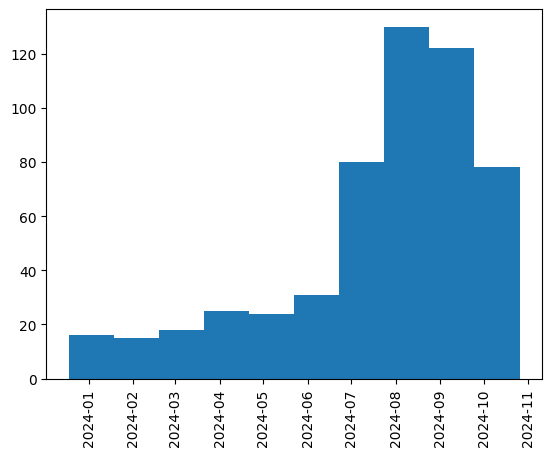

# FactNET

This repository contains the data used in the experiments in our paper "FactNET: Granular fact-checking of complex claims with partial information" submitted at NAACL 2025 demo track.

# Data structure

Each fact-check is contained in a different JSON file following the same schema:

```
{
    "claim": "The claim, without source or context",
    "tags": "the tags of the fact-check, for SEO purposes",
    "fact_checkers": "Journalists writing the fact-check",
    "date": "publication date of the fact-check",
    "label": "The label given by the fact-checker, different in PolitiFact or Snopes",
    "url": "The url of the fact-check",
}
```

# Data description

The dataset is composed of 547 fact-checks from PolitiFact and Snopes about the 2024 U.S. presidential election, collected between December, 18 2023 and October, 26 2024.
To ensure the topics of the claims, we collect fact-checks from the PolitiFact elections category (https://www.politifact.com/elections/) and the Snopes 2024 Election tag (https://www.snopes.com/tag/2024_presidential_campaign/).

The distribution of fact-checks over time is given below, with a natural spike before the date of the election (November, 5 2024).

<p align="center">
  
</p>

Labels used by PolitiFact and Snopes are different, but can be grouped into large categories of <span style="color:green">True</span>, <span style="color:red">False</span> and <span style="color:orange">Mixed</span>. Labels counts are given in the table below.

<center>

| Label    | Count |
| -------- | ------- |
| <span style="color:red">False</span>  | 175    |
| <span style="color:red">Pants of Fire</span> | 43     |
| <span style="color:red">Fake</span>    | 39    |
| <span style="color:red">Mostly False</span>    | 24    |
| <span style="color:orange">Labeled Satire</span>    | 25    |
| <span style="color:orange">Originated as Satire</span>    | 16    |
| <span style="color:orange">Unfounded</span>    | 16    |
| <span style="color:orange">Mixture</span>    | 15    |
| <span style="color:orange">Half True</span>    | 15    |
| <span style="color:orange">None</span>    | 15    |
| <span style="color:orange">Unproven</span>    | 10    |
| <span style="color:orange">Miscaptioned</span>    | 10    |
| <span style="color:orange">Misattributed</span>    | 5    |
| <span style="color:orange">Research in Progress</span>    | 4    |
| <span style="color:orange">Outdated</span>    | 1    |
| <span style="color:green">True</span>    | 73    |
| <span style="color:green">Correct Attribution</span>    | 37    |
| <span style="color:green">Mostly True</span>    | 16    |

<\center>